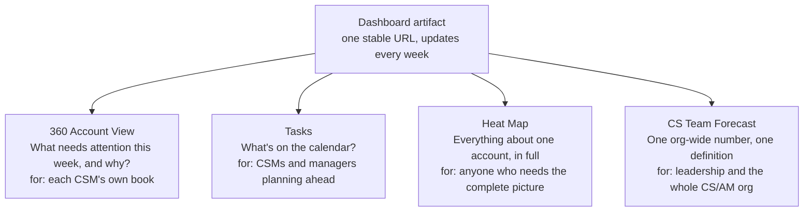

# Customer Success Agent - a Claude Playbook

A **Customer Success monitoring agent** built in the
[Claude desktop app](https://claude.com/download) - designed so a non-technical CS/AM team can
run it themselves, day to day. Getting connected takes a short, one-time technical setup
(Salesforce, and optionally Zendesk/Clari) that you can do yourself or hand to a teammate or IT;
after that, there's no server and no ongoing engineering work to keep it running. It watches
your customer accounts across **Salesforce, Zendesk, Pendo, Clari, and the web**, publishes a
**four-tab dashboard**, and pings you in **Slack** - automatically, every week.

This page is organized in three parts: **why** this exists, **what** it does, and **how** it's
built. If you only read one part, read the first - it's the part that explains why this isn't
just an AI wrapper around some tools.

> **Just want to run it?** Skip to [Get started](#get-started) - most of it is click-through;
> Salesforce needs about 10 minutes of one-time technical setup (Zendesk/Clari add ~10 minutes
> each, whenever you're ready), which you can hand to a technical teammate or IT if you'd rather
> not do it yourself. **Want the full reasoning behind every choice?** See
> [docs/design-decisions.md](docs/design-decisions.md) and
> [docs/iteration-notes.md](docs/iteration-notes.md) - this README summarizes both.

---

## Why this exists

Two versions of the same underlying problem, solved the same way.

**Weekly account visibility.** A manual pass across a CRM, a support desk, a usage-analytics
tool, a forecast tool, and outside news, repeated for every account, every week, does not survive
contact with a busy quarter - not from lack of effort, but because cross-referencing systems by
hand gets harder every time you add another, and a missed account looks identical to a quiet one
until something breaks (see [docs/iteration-notes.md](docs/iteration-notes.md)). This project
alone spans **seven connected systems** - Salesforce, Zendesk, Pendo, Clari, web search, Slack,
and Tability - on top of what it replaced: a spreadsheet-pooled forecast process and the
manual cross-referencing described above.

**Org-wide forecasting.** Before this project's forecast tab existed, the whole team's renewal
and upsell number was pooled by hand, in spreadsheets, from roughly 15 CSMs and AMs, then rolled
up for leadership. That process didn't just cost time; it wasn't measuring the same thing across
submitters. One person's number was a commit figure, another's was upside, and both landed in the
same bucket with no flag that they weren't equivalent. At best, we can call it
**"hopecasting"** - a forecast that routinely missed reality in both directions, because it was
never built on one consistent definition to begin with.

Both problems have the same fix: **one automatically-refreshed, precisely-defined source of
truth**, instead of a manual reconstruction that degrades under load or drifts across whoever's
compiling it that week. Four dashboard tabs exist because four different people ask four
different questions of that same underlying data - see [What was built](#what-was-built) below.

**Why not an existing 360-view tool.** Off-the-shelf customer-success platforms were tried
before this was built, and none of them fit cleanly - not because the products were bad, but
because of how this company's own Salesforce is modeled. Accounts here have multiple child
accounts under one parent, and opportunities live at the **contact** level, not the account
level - a data shape most 360-view tools simply assume away. Every tool evaluated had to be bent
around that shape, or ignore part of it, and none did both cleanly enough to trust for a whole
team's weekly workflow. Building directly on Claude meant the account view could be built to
match this company's actual CRM structure, instead of forcing the CRM to match someone else's
product assumptions. See
[why, in design-decisions.md](docs/design-decisions.md#why-not-an-off-the-shelf-360-view--customer-success-platform)
for the specific data-shape mismatches that ruled out every tool evaluated.

This wasn't assembled by pointing an AI at some connected tools and taking whatever came out.
Every choice below - what stays read-only and why, which four tabs and why not one or five, why a
filtering approach that looked reasonable at first got reversed months in, why the forecast tab's
field-level definitions went through several correction rounds against a reference before they
were trusted - was made deliberately, run against a live account book for months, and corrected
when real usage proved an assumption wrong. [docs/design-decisions.md](docs/design-decisions.md)
and [docs/iteration-notes.md](docs/iteration-notes.md) are the record of that thinking, not
documentation written after the fact to justify it.

---

## What was built

### The weekly routine

Once a week (Thursdays at 2pm), the agent:

1. Pulls upcoming **renewals + ARR** from Salesforce (read-only).
2. Checks **Pendo** for usage risk - accounts gone quiet, or dormant longer than expected -
   including accounts that only look dormant because their real usage happens through a
   reseller, partner, or a child/sub-account.
3. Pulls **support ticket volume, open-ticket count, and category mix** from Zendesk, matched to
   each account even when the support desk itself doesn't tag tickets by organization.
4. Optionally checks **Clari** for forecast/pipeline signal on the account's open opportunities.
5. Searches the **web** for notable, business-relevant news and published studies per account.
6. Pulls the **latest customer communication** (who / when / subject) from Salesforce, plus any
   recent internal **handoff note** left in Salesforce Chatter (e.g. "watch this while I'm out").
7. Publishes the **four-tab dashboard artifact** - see [Four views, one dashboard](#four-views-one-dashboard)
   below. The URL stays the same every week; it updates in place.
8. Sends a **short Slack DM** - the **top 3 most urgent accounts** and a link to the full
   dashboard.
9. Optionally logs a **Tability check-in** on your Customer Health OKR, so progress tracking
   stays current without manual entry.

Every account in the book gets reviewed, every run - a deliberate reversal of the original
"only show me what needs attention" design once that filtering turned out to be hiding real
risk. See [why, in design-decisions.md](docs/design-decisions.md#why-we-walked-back-signal-only).

See a full sample: [docs/sample-slack-digest.md](docs/sample-slack-digest.md).

### Four views, one dashboard

The dashboard is one Claude artifact with four tabs, each answering a different question, for a
different audience:



| Tab | Answers | Built from | Mainly for |
|-----|---------|------------|------------|
| **360 Account View** | "What needs attention this week, and why?" | Salesforce, Pendo, Zendesk, news/studies, Chatter | Each CSM's own book |
| **Tasks** | "What's on the calendar - renewals, QBRs, reviews - for the whole team?" | Salesforce renewal dates, on a repeating touchpoint schedule (see [iteration notes](docs/iteration-notes.md)) | CSMs and managers planning ahead |
| **Heat Map** | "Show me every account, colored by urgency, with a full per-account detail panel." | All of the above, plus Clari and the report catalogs below | Anyone who needs the complete picture on one account |
| **CS Team Forecast** | "What does the org actually expect to close this month and quarter - one number, one definition, every team?" | Salesforce renewal + upsell opportunities, bucketed by one shared rule set applied identically to every CSM | Leadership and the whole CS/AM org |

Four tabs, not one, because stretching "what needs my attention," "what's on the calendar,"
"everything about this one account," and "the org-wide number leadership needs" into a single
view would mean compromising all four. Each one exists because a real person asking a real
question needed the answer shaped differently than the others - see
[docs/design-decisions.md](docs/design-decisions.md) for the tab-by-tab reasoning, most recently
[why the CS Team Forecast tab](docs/design-decisions.md#why-a-tab-4-cs-team-forecast-tab).

Clicking any account in any tab jumps to its detail panel - no separate lookup, no tab-switching
to piece the picture together by hand.

**Optional companions**, built the same way - just ask Claude, no custom setup needed - that the
Heat Map's per-account panel can cross-reference: a searchable catalog of **published studies
that used your product** and a searchable catalog of **reports done with competitor tools**. Ask
Claude to build these the same way as the main dashboard if you want them; they're independent
artifacts, not required for the core routine.

### Colored urgency indicators

Each account in the **360 Account View** and **Heat Map** gets a color-coded card:

- Red (Act Now) - renewal within 30 days, OR a high-value account with no activity in over 90
  days, OR a lost renewal still inside its close month (still recoverable through month-end)
- Blue (Watch) - renewal 31-90 days out, OR moderate usage risk (quiet for 60-90 days)
- Green (FYI) - informational signal only (news, published study, healthy usage); no immediate
  risk
- Gray (Rest of Accounts) - nothing to report this week; collapsed by default so the meaningful
  tiers stay in view, but still searchable/filterable and still reviewed every run

A lost renewal stays Act Now for the rest of its close month - it's still recoverable until then.
Once that month ends without recovery, the account is no longer an active customer: it's treated
as churned and drops off the book entirely, rather than lingering as an informational FYI card.

Not every account carries equal weight, on purpose: a renewal deadline escalates any account
regardless of size, but usage-risk dormancy only escalates to Act Now above an ARR threshold -
below it, the same dormancy lands in Watch instead. Without that gate, a single usage-data
refresh once put a quarter of the whole book into Act Now at once, which defeats what the tier is
for. See [why, in design-decisions.md](docs/design-decisions.md#why-usage-risk-escalation-is-gated-by-arr-and-other-tiers-arent).

---

## Results & Impact

This has been running as a real weekly routine - not a demo - since June 2026, against an
active, multi-account CS book, and has grown from four data sources to six over that time.

**~4-5 hours a week given back to every CSM.** That's what it took, per person, to manually
track and reconstruct an account-level overview across every system before this existed - time
that now goes into the routine instead of into status-checking. Across an 11-person CS team,
that's roughly **45-55 hours a week redirected from manual tracking to revenue-generating
activity**: renewal calls, QBR prep, and expansion conversations, not spreadsheet reconciliation.

**What it replaced:** a manual weekly pass across every account, cross-referencing a CRM, a
support desk, a usage-analytics tool, a forecast tool, and outside news by hand, then writing up
a summary - repeated every week, for every account, regardless of whether anything had actually
changed. And, separately, a spreadsheet-pooled org forecast reassembled by hand from roughly 15
people every cycle.

**What changed:**

- **Multi-source correlation on autopilot, across a growing number of systems.** Every account
  gets renewal timing, usage trend, support-ticket load, forecast context, external news, and
  last-touch/handoff-note context assembled automatically each week - the kind of
  cross-referencing that quietly stops happening by hand the first busy week, and that gets
  harder to do by hand every time you add a source, not easier.
- **Caught things a manual process had been missing** - and kept catching new ones as sources
  were added. See [docs/iteration-notes.md](docs/iteration-notes.md) for specifics: a name
  change that had been silently dropping a manager's entire book from view; usage-risk false
  positives from accounts used indirectly through a partner or child account; a support desk
  where ticket-to-organization tagging turned out to be unreliable on ~90% of tickets, requiring
  a different matching approach entirely; and - the big one - a filtering design that was
  quietly hiding real usage risk on accounts it had decided weren't worth showing.
- **A fuller picture per account, not just a longer list of sources.** The Heat Map's
  per-account panel is the "every corner of every system, one screen" view - the thing that
  used to require opening half a dozen separate tools to reconstruct by hand.
- **One forecast number instead of ~15 people's spreadsheets.** The CS Team Forecast tab replaced
  a manual pooling process across the whole CS/AM org with one live, identically-defined number
  per CSM - closing the gap between what leadership expected and what actually happened that the
  team had started calling "hopecasting."
- **Resilient by design.** When a data source is temporarily unreachable, the routine still runs
  and flags what it couldn't check, rather than failing outright or silently omitting it (see
  [docs/iteration-notes.md](docs/iteration-notes.md)).

*(Figures and specifics above reflect this project's own production history. If you adapt this
for your own team, swap in your own measurements and sources - the structural lessons don't
depend on any particular numbers or tool list to be true.)*

---

## How it's built

### Architecture

```
                    +-------------------------------------------------+
                    |             Claude (desktop app)                |
                    |       runs your routine once a week             |
                    +-------------------------------------------------+
                       |        |         |        |         |         |
                  read |   read |     read |   read |     web |   build/send
                       v        v         v        v         v         v
                 Salesforce  Pendo   Zendesk    Clari   Web search   Artifact
                   (MCP)   (connector) (MCP)     (MCP)                dashboard
                                                                     (4 tabs, stable URL)
                                                                          |
                                                                          v
                                                              Slack (connector) + optional
                                                              Tability check-in (connector)
```

Slack, Pendo, and Tability plug in through **Claude connectors** - secure links to tools your
company already uses, enabled with a click and a browser sign-in. **Salesforce, Zendesk, and
Clari are the exceptions:** none of them had a ready-made connector for this org, so each is
added with a short one-time **MCP setup** - the same pattern applied three times. See
[SETUP.md](SETUP.md) Step 3 and [docs/adding-a-custom-source.md](docs/adding-a-custom-source.md)
for the general recipe.

The dashboard artifact is built by Claude itself - no hosting, no server, no external service.
It's a web page Claude publishes to claude.ai. You link to it from Slack.

### Read-only by design

This agent only ever **reads** your systems of record - it should never change data in
Salesforce, Zendesk, or Clari. The best way to guarantee that for Salesforce is a **read-only
login**; ask your admin to set one up using
[docs/salesforce-readonly-user-setup.md](docs/salesforce-readonly-user-setup.md). For Zendesk and
Clari, the custom MCP servers built in
[docs/adding-a-custom-source.md](docs/adding-a-custom-source.md) simply never expose a write
tool - there's nothing to accidentally call.

### Get started

[SETUP.md](SETUP.md) has the click-by-click guide (Windows and Mac). In short:

1. Install the **Claude desktop app** and sign in.
2. **Connect** Slack and Pendo (and Tability if you use it) - one click each.
3. **Add Salesforce, Zendesk, and Clari** via the short MCP setup ([SETUP.md](SETUP.md), Step 3;
   pattern detailed in [docs/adding-a-custom-source.md](docs/adding-a-custom-source.md)) - or
   hand that step to a technical teammate or IT. Zendesk and Clari are optional; add them
   whenever you're ready, the routine works with just Salesforce + Pendo in the meantime.
4. Paste the routine from [examples/weekly-digest-task.md](examples/weekly-digest-task.md) and
   ask Claude to run it weekly.

---

## Evolution: v1 → v2 → v3

This project shipped in three stages, each one a response to something a live account book
actually surfaced - not a plan drawn up in advance and executed unchanged.

**v1 - the original digest.** Four sources (Salesforce, Pendo, web search, Slack, plus optional
Tability), strict signal-only filtering, a single-tab dashboard. Preserved in this repo's git
history and still reasoned about in [design-decisions.md](docs/design-decisions.md) and
[iteration-notes.md](docs/iteration-notes.md) alongside the v2/v3 changes, rather than being
overwritten by them.

**v2 - two more sources, a fuller per-account view, and a reversal.** Running v1 for real, for
months, against a full account book, changed four things:
1. **Added Zendesk** (ticket volume, open count, category) once API access existed - see
   [why CSAT didn't make the cut](docs/design-decisions.md#why-add-zendesk-after-all).
2. **Added Clari** (forecast/pipeline context) as an optional, strictly read-only signal - see
   [why it's optional](docs/design-decisions.md#why-clari-and-why-its-optional).
3. **Added the Heat Map tab** - a full per-account panel pulling from every connected source at
   once, instead of that detail only existing implicitly across several tools a person would
   have to check separately.
4. **Walked back signal-only filtering.** Every account now gets reviewed every run; accounts
   with genuinely nothing to report land in a collapsed, neutral "Rest of Accounts" group
   instead of disappearing entirely - see
   [why](docs/design-decisions.md#why-we-walked-back-signal-only), it's the most important
   lesson in this whole project.

**v3 - the CS Team Forecast tab.** A fourth tab for a different audience than the first three:
not "what does one CSM need to act on this week," but "what does the whole team's renewal and
upsell forecast add up to, right now, on one definition everyone actually agrees on." It replaced
the spreadsheet-pooled "hopecasting" process described in [Why this exists](#why-this-exists)
above. See [design-decisions.md](docs/design-decisions.md#why-a-tab-4-cs-team-forecast-tab) for
the full reasoning and [iteration-notes.md](docs/iteration-notes.md) for the correction rounds it
took to get the field-level definitions exactly right - this tab is the one place in the whole
dashboard where multiple people's numbers land in a single figure, so precision here mattered
more than anywhere else in the project.

---

## What's in this repo

| Path | What |
|------|------|
| [SETUP.md](SETUP.md) | **Start here** - step-by-step setup (mostly click-based) |
| [docs/design-decisions.md](docs/design-decisions.md) | Why each choice was made, and what was rejected |
| [docs/iteration-notes.md](docs/iteration-notes.md) | What broke running this for real, and what's next |
| [docs/adding-a-custom-source.md](docs/adding-a-custom-source.md) | The reusable pattern for connecting a tool with no official MCP connector (used for Salesforce, Zendesk, and Clari) |
| [salesforce/salesforce-mcp-config.json](salesforce/salesforce-mcp-config.json) | Salesforce MCP config (read-only) - used in SETUP Step 3 |
| [zendesk/zendesk-mcp-config.json](zendesk/zendesk-mcp-config.json) | Zendesk MCP config (read-only, custom server) |
| [clari/clari-mcp-config.json](clari/clari-mcp-config.json) | Clari MCP config (read-only, custom server, optional) |
| [examples/weekly-digest-task.md](examples/weekly-digest-task.md) | The routine instructions you give Claude |
| [examples/accounts.sample.json](examples/accounts.sample.json) | **Fake** account list (shows the shape) |
| [docs/sample-slack-digest.md](docs/sample-slack-digest.md) | Example of the weekly Slack summary and dashboard |
| [docs/salesforce-readonly-user-setup.md](docs/salesforce-readonly-user-setup.md) | For your admin: read-only Salesforce login |
| [docs/google-docs-connector-request.md](docs/google-docs-connector-request.md) | Optional extension: what to ask IT for to enable auto-updating account docs |
| [advanced/](advanced/) | Optional: extra client-side write-protection guardrail |

---

## Privacy

This tutorial contains **no real data** - every name, account, ticket, and ID is a placeholder
or fake example. Your real customer list, tickets, forecasts, and credentials stay inside your
own Claude app and connected tools; nothing sensitive lives in this repo.

---

## License

MIT - use it, adapt it, share it with your team.
